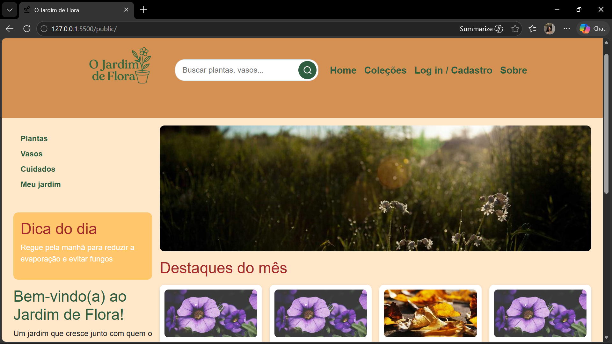
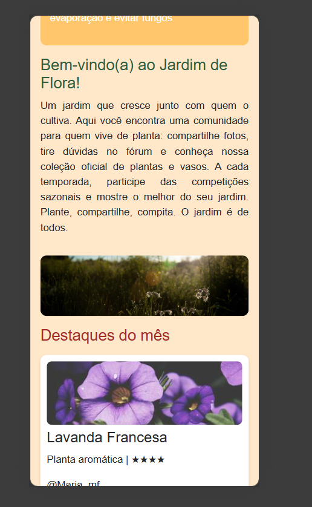

# Trabalho Prático - Semana 6

Nessa atividade, como sempre, vamos evoluir o que foi feito na semana anterior. Fique atento para fazer o projeto da semana anterior e dar sequência nessa jornada.

No trabalho dessa semana vamos alterar o projeto para que a responsividade da home-page seja feita, agora, com o framework Bootstrap.

**IMPORTANTE 1:** Você deve alterar apenas os arquivos **`README.md`**, **`index.html`** e **`styles.css`**, podendo incluir outros arquivos como imagens na pasta **`images`**, caso necessário. Deixe todos os demais arquivos e pastas desse repositório inalterados. **PRESTE MUITA ATENÇÃO NISSO.**

## Informações Gerais

- Nome: Sophia Nicole Ferreira Reis Gonçalves
- Matricula: 908436
- Proposta de projeto escolhida: 4 - Coleções e itens
- Breve descrição sobre seu projeto: O Jardim de Flora é uma aplicação web voltada para amantes de plantas. O site reúne três funcionalidades principais: um fórum onde os usuários interagem entre si, uma página de coleções que funciona como um perfil exibindo plantas e vasos com fotos e curiosidades, e competições sazonais onde a comunidade elege as melhores plantas de cada temporada.

## Print da versão responsiva com Bootstrap [DESKTOP]

## Print da versão responsiva com Bootstrap [MOBILE] 

